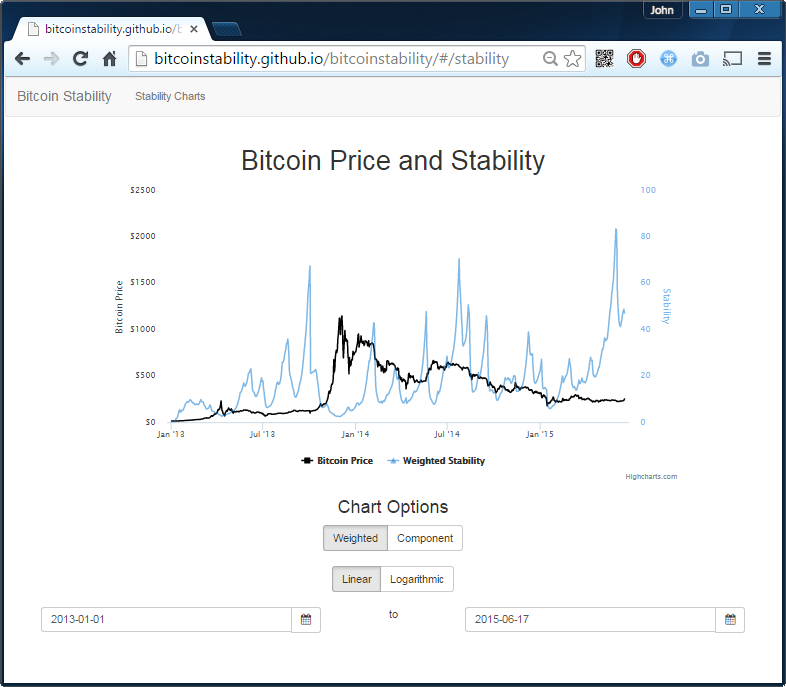

# Bitcoin Stability
Home of the Bitcoin Stability Charts, inspired/supported by Reddit user "Azop" and http://www.reddit.com/r/BitcoinMarkets/comments/36rn9h/help_uazop_internet_his_excel/

If you want to contribute, PM jtibble on reddit, twitter, or here on Github

# Current status: Restored

Try it out at http://bitcoinstability.github.io/bitcoinstability/

